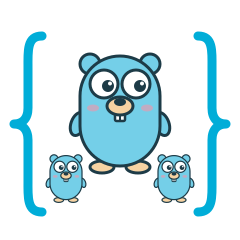

# scopher

<p align="center">
  
</p>

Structured concurrency for Go, inspired by Kotlin's `coroutineScope`.

> Experimental. The API may change before v1.0.0.

Goroutines started in a scope can't outlive it. `scope.Run` waits for all of
them, cancels the rest when one fails, and re-panics on the caller's goroutine
if one panics.

Needs Go 1.27+.

```sh
go get github.com/xorps/scopher/scope
```

## Usage

### Fork and await

`s.Fork` starts a task and returns a handle you can `Await`.

```go
import "github.com/xorps/scopher/scope"

err := scope.Run(ctx, func(ctx context.Context, s *scope.Scope) error {
	user := s.Fork(func(ctx context.Context) (User, error) {
		return fetchUser(ctx, id)
	})
	orders := s.Fork(func(ctx context.Context) ([]Order, error) {
		return fetchOrders(ctx, id)
	})

	u, err := user.Await(ctx)
	if err != nil {
		return err
	}
	o, err := orders.Await(ctx)
	if err != nil {
		return err
	}
	return render(u, o)
})
```

### Returning a value

`scope.RunValue` is `Run` with a return value.

```go
func loadPage(ctx context.Context, id string) (Page, error) {
	return scope.RunValue(ctx, func(ctx context.Context, s *scope.Scope) (Page, error) {
		user := s.Fork(func(ctx context.Context) (User, error) {
			return fetchUser(ctx, id)
		})
		orders := s.Fork(func(ctx context.Context) ([]Order, error) {
			return fetchOrders(ctx, id)
		})

		u, err := user.Await(ctx)
		if err != nil {
			return Page{}, err
		}
		o, err := orders.Await(ctx)
		if err != nil {
			return Page{}, err
		}
		return Page{User: u, Orders: o}, nil
	})
}
```

### Tasks without a result

`s.Go` is for tasks that only return an error. It returns a handle too, in case
you want to `Wait` on one task. Otherwise just let `Run` wait for everything.

```go
err := scope.Run(ctx, func(ctx context.Context, s *scope.Scope) error {
	for _, u := range users {
		s.Go(func(ctx context.Context) error {
			return sendEmail(ctx, u)
		})
	}
	return nil
})
```

## Behavior

- `Run` waits for every task, including tasks started by other tasks.
- The first error cancels the scope's context, and it's what `Run` returns.
  Inside a task, `context.Cause(ctx)` tells you what failed.
- `Await` always returns the same result, no matter how many times you call it.
  If its context is done first it returns `ctx.Err()`, but the task keeps
  running.
- If a task panics, its `Await` returns a `*scope.PanicError` and `Run`
  re-panics with it once the other tasks finish. The error has the original
  value and stack trace.
- Scopes nest. Call `scope.Run` inside a task to get a child scope.
- Calling `Fork` after `Run` has returned panics.
- There's no pooling or concurrency limit. Every `Fork` or `Go` is a new
  goroutine.

## License

Licensed under either of

- Apache License, Version 2.0 ([LICENSE-APACHE](LICENSE-APACHE) or <https://www.apache.org/licenses/LICENSE-2.0>)
- MIT license ([LICENSE-MIT](LICENSE-MIT) or <https://opensource.org/licenses/MIT>)

at your option.

### Contribution

Unless you explicitly state otherwise, any contribution intentionally submitted
for inclusion in the work by you, as defined in the Apache-2.0 license, shall be
dual licensed as above, without any additional terms or conditions.
